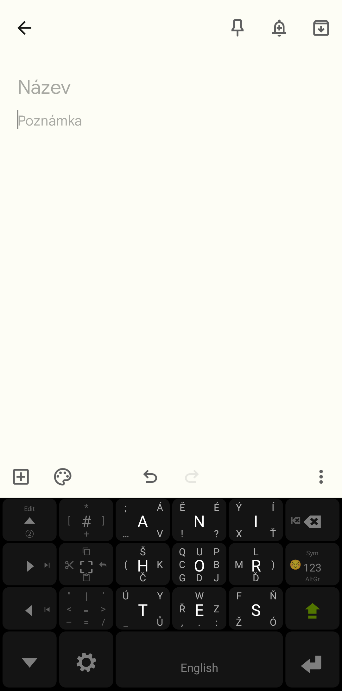

## Preview

  

## How to use

### Quickstart
Cloning my setup is fairly simple:
1. download [Multiling-o](https://play.google.com/store/apps/details?id=kl.ime.oh&hl=en&gl=US) from Google Play,
2. go to `Layouts - DIY - (Space bar) Layouts... - [+ DIY]`,
3. paste the content of `messagease-cs-base.json`,
3. repeat the steps 2&3 with `messagease-cs-double.json`,
4. go to `Settings - Misc. - Import | Export - Theme`,
5. paste the content of `theme.cfg`.

### Customizing the layout
If you wish to edit the layout, edit the JSON files externally and then paste it using the "Layouts..." button inside the app.

The structure of the JSON files is intuitive:
- for a simple pressable button just use the character itself,
- for a swipable button, use the format `[4D:abcdefghi]` in which:
  - for `a` press the button,
  - for `b`, `c`, `d`, `e` swipe left, up, right, and down,
  - for `f`, `g`, `h`, `i` swipe NE, NW, SW, SE.

Some directions may be omitted using a " " (space).

## Screenshots

### Base

  

### Double

  

### Symbols

  

### Numpad

  

### AltGr

  

### Emoji

  

